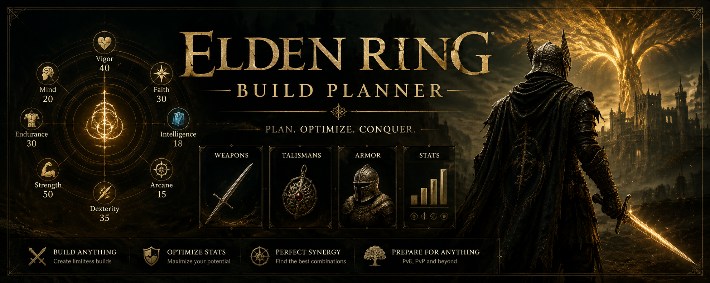
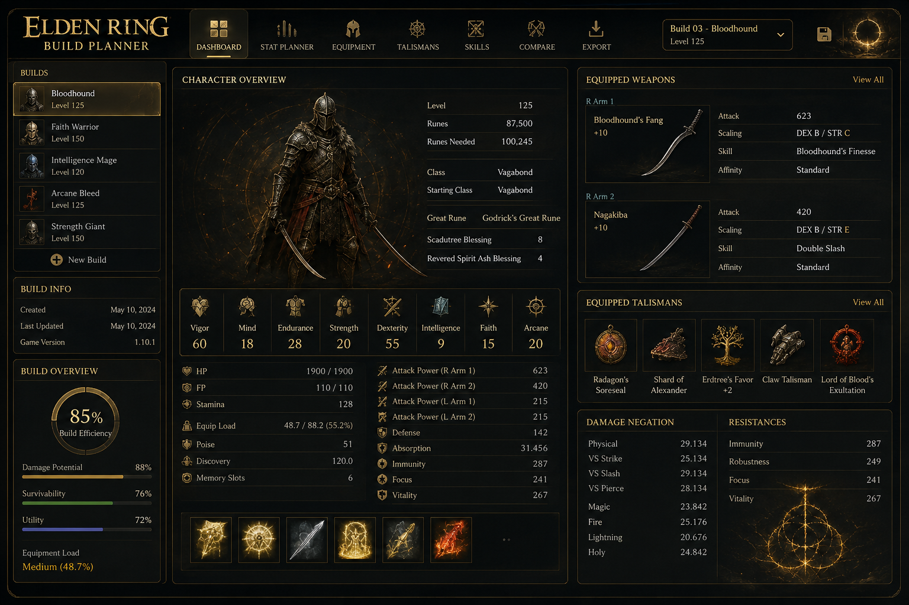
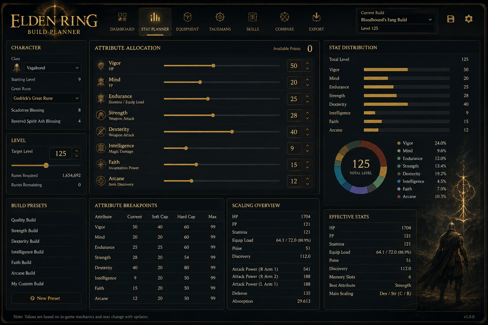
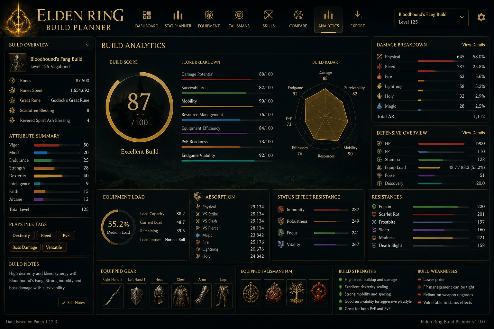

# Elden-Ring-Build-Planner
Plan character builds, optimize stats, compare weapons, manage talismans, and create powerful Elden Ring loadouts from a modern desktop interface.

# Elden Ring Build Planner

<p align="center">
  
</p>

<h1 align="center">Elden Ring Build Planner</h1>

<p align="center">
  Forge your perfect Tarnished. Plan every attribute, weapon, talisman and ending before you spend a single rune.
</p>

---

## Become the Tarnished You Were Meant to Be

Every level matters.

Every attribute point changes your build.

Every weapon scales differently.

Elden Ring Build Planner helps players design complete character builds before investing hours into leveling, farming, upgrading equipment, and collecting talismans.

Whether you're creating a colossal strength warrior, a lightning faith caster, an intelligence mage, or a dexterity bleed build, this planner allows you to experiment freely and optimize your character before entering the Lands Between.

---

## Build Planning System

### Character Classes

Compare starting classes:

* Vagabond
* Warrior
* Hero
* Bandit
* Astrologer
* Prophet
* Samurai
* Prisoner
* Confessor
* Wretch

See how each class affects your final build efficiency.

---

### Attribute Simulator

Plan every level.

Monitor:

* Vigor
* Mind
* Endurance
* Strength
* Dexterity
* Intelligence
* Faith
* Arcane

Experiment with different level caps:

```text
Level 50
Level 100
Level 125
Level 150
Level 200
```

Perfect for PvE and PvP planning.

---

## Weapon Builder

Discover which weapons truly fit your build.

Analyze:

* Stat requirements
* Attribute scaling
* Upgrade paths
* Weapon categories
* Build compatibility

Supported categories include:

* Greatswords
* Colossal Weapons
* Katanas
* Spears
* Twinblades
* Curved Swords
* Staves
* Sacred Seals

---

## Talisman Optimization

Builds are won and lost through synergy.

Create combinations using:

* Damage Talismans
* Defensive Talismans
* Utility Talismans
* Status Effect Talismans

Instantly see how each choice impacts the overall build.

---

## Build Analytics

Track:

* Total Build Efficiency
* Damage Potential
* Survivability Rating
* Resource Management
* Equipment Load
* PvP Readiness
* Endgame Viability

---

## Screenshots

### Build Dashboard



### Stat Planner



### Build Analytics



---

## Designed For

### PvE Players

Create powerful builds for exploration, bosses, and New Game Plus.

### PvP Players

Optimize around popular duel and invasion level brackets.

### Challenge Runners

Plan RL1, no-hit, themed, and challenge builds.

### Theorycrafters

Experiment with endless build combinations without wasting runes.

---

## Why Use Build Planner?

Instead of spending dozens of hours testing builds manually:

✔ Compare classes instantly

✔ Plan future level progression

✔ Test weapon combinations

✔ Optimize talisman loadouts

✔ Create PvP-ready characters

✔ Prepare complete endgame builds

---

## Download

Latest Release

```text
Elden-Ring-Build-Planner-v3.1.5.zip
```

Executable

```text
EldenRingBuildPlanner.exe
```

---

## The Lands Between Await

The difference between a good build and a legendary build starts with planning.
